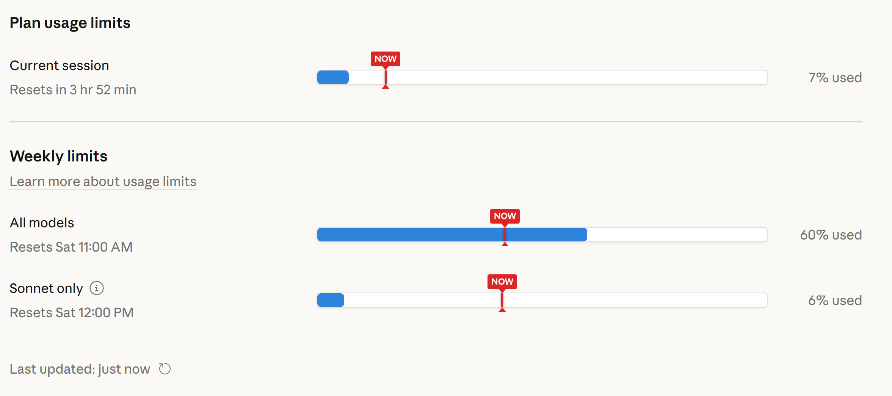

# Claude Usage Reticle

A simple visual marker showing where your Claude usage *should* be based on time elapsed in the reset window.



## What It Does

Adds a red **"NOW"** reticle line on your Claude usage bars (Settings > Usage). Instantly see if you're ahead or behind your usage budget:

- **Bar behind reticle** → Under budget, you have capacity
- **Bar ahead of reticle** → Over budget, consider slowing down
- **Bar at reticle** → Perfect pacing

Works with all three usage types:
- Current session (5-hour window)
- All models (weekly)
- Sonnet only (weekly)

## Installation

### Option 1: Bookmarklet (Easiest - No Install)

1. Visit the **[installation page](https://katsujincode.github.io/claude-usage-reticle/bookmarklet.html)**
2. Drag the red button to your bookmarks bar
3. Go to [claude.ai/settings](https://claude.ai/settings) → Usage
4. Click the bookmark

That's it! Click the bookmark whenever you want to see the reticle.

### Option 2: Tampermonkey (Auto-runs)

For automatic running every time you visit the page:

1. Install [Tampermonkey](https://www.tampermonkey.net/) browser extension
2. **[Click here to install the script](https://github.com/KatsuJinCode/claude-usage-reticle/raw/main/usage-reticle.user.js)** - Tampermonkey will prompt you to install
3. Visit Claude's usage page - the reticle appears automatically

## How It Works

The reticle position is calculated as:

```
Current Session: (5 - hours_until_reset) / 5 * 100%
Weekly Limits:   (168 - hours_until_reset) / 168 * 100%
```

For example, if your weekly limit resets Saturday at 11 AM and it's currently Wednesday at 5 PM, about 103 hours have passed out of 168, so the reticle appears at ~61%.

## Limitations

- The script relies on Claude's current page structure. If Anthropic updates their UI, it may need updating.
- The bookmarklet runs once per click. Navigate away and back? Click it again.

**Last tested:** December 2024

## Files

| File | Purpose |
|------|---------|
| `bookmarklet.html` | Installation page with drag-to-install button |
| `usage-reticle.user.js` | Tampermonkey userscript |
| `test-time-parsing.html` | Unit tests for time calculation |

## License

MIT - Use it, share it, modify it.

---

*Made for the Claude community. Not affiliated with Anthropic.*
